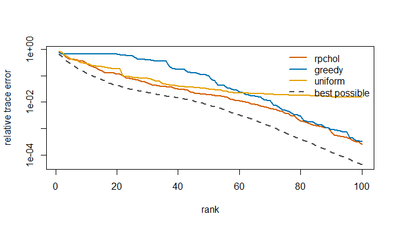

<!-- README.md is generated from README.Rmd. Please edit that file. -->

# matsketch <a href="https://mqfarooqi1.github.io/matsketch/"></a>

<!-- badges: start -->

[](https://github.com/mqfarooqi1/matsketch/actions/workflows/R-CMD-check.yaml)
[](https://github.com/mqfarooqi1/matsketch/blob/main/LICENSE.md)
<!-- badges: end -->

matsketch answers questions about a large positive-semidefinite matrix,
such as a kernel matrix, a genomic relationship matrix or a covariance
matrix, while reading only a small part of it. It implements recent
randomized algorithms from numerical linear algebra that had no R
implementation:

- `rpchol()`: **randomly pivoted Cholesky**, which builds a near-optimal
  low-rank approximation from about $(k + 1)n$ of the matrix’s $n^2$
  entries (Chen, Epperly, Tropp and Webber, 2025), with the accelerated
  rejection-sampling variant (Epperly, Tropp and Webber, 2025).
- `trace_est()` and `diag_est()`: the **XTrace, XNysTrace and XDiag**
  estimators, which recover a trace or diagonal from a few matrix-vector
  products (Epperly, Tropp and Webber, 2024), with Hutch++ and
  Girard-Hutchinson for comparison.
- `nystrom_precond()` and `pcg()`: **randomized Nyström
  preconditioning** for conjugate gradients (Frangella, Tropp and Udell,
  2023).
- `reml_sketch()`: all three combined into **REML for genomic variance
  components** that never forms the covariance matrix, and with
  `grm_matrix()` never forms the relationship matrix either.

Each estimator is tested against a brute-force version of its
definition.

## Installation

Install the development version from GitHub:

``` r
# install.packages("pak")
pak::pak("mqfarooqi1/matsketch")
```

## Example

A Gaussian kernel on 1,500 points in two clusters with a few outliers.
`kernel_matrix()` stores only the points, and `rpchol()` reads the
entries it needs:

``` r
library(matsketch)
set.seed(1)
X <- rbind(matrix(rnorm(2 * 1300, sd = 0.5), ncol = 2),
           matrix(rnorm(2 * 180, sd = 0.2), ncol = 2) + 4,
           matrix(runif(2 * 20, -6, 10), ncol = 2))
K <- kernel_matrix(X, bandwidth = 0.5)
fit <- rpchol(K, k = 100)
fit
#> <rpchol> rank-100 approximation of a 1500 x 1500 matrix (accelerated)
#>   relative trace error : 2.495e-04
#>   entries read         : 152,900 of 2,250,000 (6.80%)
```

Against the classical rules at the same budget, and the best possible
error at each rank:



The trace of a matrix known only through products:

``` r
U <- qr.Q(qr(matrix(rnorm(500 * 500), 500)))
A <- U %*% ((1:500)^-2 * t(U))
c(truth = sum(diag(A)),
  xtrace = trace_est(A, m = 60)$estimate,
  hutchinson = trace_est(A, m = 60, method = "hutchinson")$estimate)
#>      truth     xtrace hutchinson 
#>   1.642936   1.643178   1.637572
```

Genomic REML with the relationship matrix never formed:

``` r
dat <- sim_genomic(n = 1000, p = 2000, h2 = 0.5, pops = 4)
reml_sketch(dat$y, grm_matrix(dat$M))
#> <reml_sketch> converged in 3 iterations (rpchol rank-100 preconditioner, XTrace with 40 products)
#>          estimate std.error
#> genetic    0.4238    0.0664
#> residual   0.5275    0.0541
#> h2         0.4455    0.0599
#>   linear systems solved : 136 (mean 8.6 CG iterations)
```

## Learn more

- [Randomized matrix computations with
  matsketch](https://mqfarooqi1.github.io/matsketch/articles/matsketch.html)
  runs each method on a problem where its advantage is easy to see.
- [Genomic REML without forming the covariance
  matrix](https://mqfarooqi1.github.io/matsketch/articles/genomic-reml.html)
  explains the REML fit and measures its accuracy and scaling against
  exact REML.

## References

Chen, Y., Epperly, E. N., Tropp, J. A. and Webber, R. J. (2025).
Randomly pivoted Cholesky: practical approximation of a kernel matrix
with few entry evaluations. *Communications on Pure and Applied
Mathematics* 78, 995–1041.
[doi:10.1002/cpa.22234](https://doi.org/10.1002/cpa.22234)

Epperly, E. N., Tropp, J. A. and Webber, R. J. (2024). XTrace: making
the most of every sample in stochastic trace estimation. *SIAM Journal
on Matrix Analysis and Applications* 45, 1–23.
[doi:10.1137/23m1548323](https://doi.org/10.1137/23m1548323)

Epperly, E. N., Tropp, J. A. and Webber, R. J. (2025). Embrace
rejection: kernel matrix approximation by accelerated randomly pivoted
Cholesky. *SIAM Journal on Matrix Analysis and Applications* 46,
2527–2557. [doi:10.1137/24m1699048](https://doi.org/10.1137/24m1699048)

Frangella, Z., Tropp, J. A. and Udell, M. (2023). Randomized Nyström
preconditioning. *SIAM Journal on Matrix Analysis and Applications* 44,
718–752. [doi:10.1137/21m1466244](https://doi.org/10.1137/21m1466244)

To cite matsketch itself, run `citation("matsketch")`.
