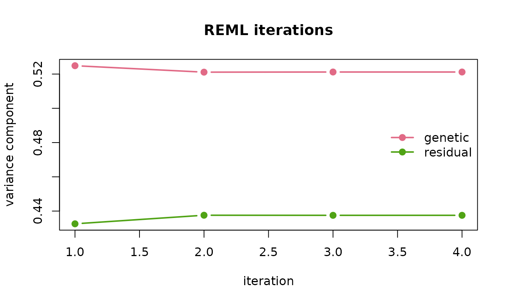
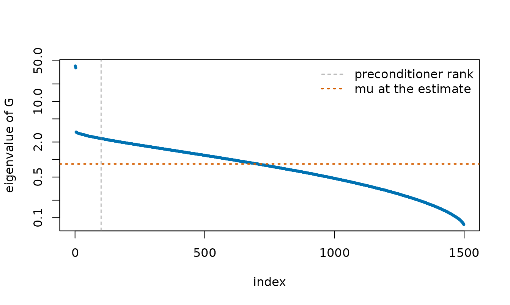
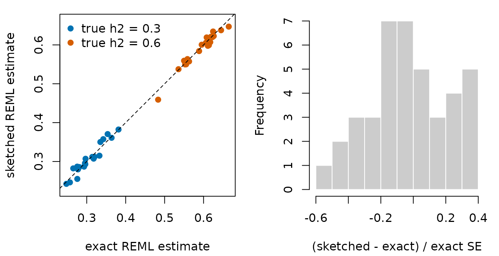
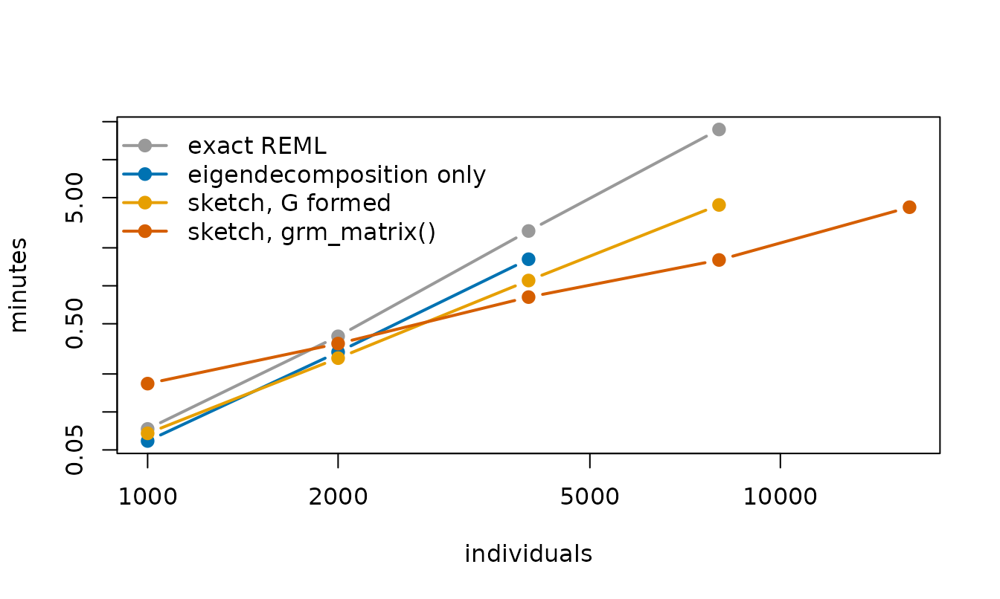

# Genomic REML without forming the covariance matrix

Heritability estimation and genomic prediction rest on the linear mixed
model
``` math
y = X\beta + g + e, \qquad g \sim N(0, \sigma^2_g G), \qquad
e \sim N(0, \sigma^2_e I),
```
where $`G`$ is the genomic relationship matrix among $`n`$ individuals.
Its variance components are estimated by restricted maximum likelihood
(REML), usually with the average-information algorithm of Gilmour,
Thompson and Cullis (1995). Every iteration of the exact algorithm
factorizes $`V = \sigma^2_g G + \sigma^2_e I`$, which takes about
$`n^3/3`$ operations, and holds several $`n \times n`$ matrices in
memory. For 50,000 individuals each of those matrices takes 20 GB.

[`reml_sketch()`](https://mqfarooqi1.github.io/matsketch/reference/reml_sketch.md)
runs the same algorithm but replaces every step that needs $`V`$ in full
with a randomized one. This vignette explains how, checks the result
against exact REML on data sets where both can be run, and measures how
the two scale.

## What an iteration needs

Write $`P = V^{-1} - V^{-1}X(X^\top V^{-1}X)^{-1}X^\top V^{-1}`$. The
REML score is
``` math
\frac{\partial \ell}{\partial \sigma^2_g} =
  -\tfrac12\{\mathrm{tr}(PG) - y^\top PGPy\}, \qquad
\frac{\partial \ell}{\partial \sigma^2_e} =
  -\tfrac12\{\mathrm{tr}(P) - y^\top PPy\},
```
the average-information matrix is
``` math
\mathrm{AI} = \tfrac12 \begin{pmatrix}
  y^\top PGPGPy & y^\top PGPPy \\
  y^\top PPGPy & y^\top PPPy
\end{pmatrix},
```
and each iteration moves $`\theta = (\sigma^2_g, \sigma^2_e)`$ to
$`\theta + \mathrm{AI}^{-1} \partial\ell/\partial\theta`$. Apart from
the two traces, everything is a product of $`P`$ with a vector, and a
product with $`P`$ needs only solves with $`V`$.
[`reml_sketch()`](https://mqfarooqi1.github.io/matsketch/reference/reml_sketch.md)
obtains each piece as follows.

- **Solves with $`V`$.** The system $`Vx = b`$ is
  $`(G + \mu I)x = b/\sigma^2_g`$ with $`\mu = \sigma^2_e/\sigma^2_g`$.
  It is solved by conjugate gradients, preconditioned with a low-rank
  approximation of $`G`$ from
  [`rpchol()`](https://mqfarooqi1.github.io/matsketch/reference/rpchol.md)
  that is built once, before the first iteration. Only $`\mu`$ changes
  between iterations, and the preconditioner depends on $`\mu`$ only
  through a diagonal, so one approximation serves the whole fit.
- **$`\mathrm{tr}(PG)`$.** XTrace estimates it from products with
  $`PG`$, each of which costs one solve. The random test vectors are
  drawn once and reused at every iteration, so the iterations settle on
  a fixed point rather than wander with fresh noise.
- **$`\mathrm{tr}(P)`$.** $`PV`$ is a projection of rank
  $`n - \mathrm{rank}(X)`$, so
  $`\sigma^2_g\,\mathrm{tr}(PG) + \sigma^2_e\,\mathrm{tr}(P) =
  n - \mathrm{rank}(X)`$ exactly, and the second trace follows from the
  first at no cost.

With the default of 40 products for the trace, an iteration solves 44
systems, advanced together in five blocks by the block conjugate
gradient solver behind
[`pcg()`](https://mqfarooqi1.github.io/matsketch/reference/pcg.md). Each
step then multiplies $`G`$ by a block of vectors. With $`G`$ held as a
matrix that costs $`O(n^2)`$ per vector; given as `grm_matrix(M)` for an
$`n \times p`$ genotype matrix $`M`$ it costs $`O(np)`$, and $`G`$ is
never formed.

## A worked example

Simulated genotypes for 1,500 individuals from four subpopulations, on
3,000 markers, with a trait of heritability 0.5:

``` r

library(matsketch)
set.seed(11)
dat <- sim_genomic(n = 1500, p = 3000, h2 = 0.5, pops = 4)
G <- grm_matrix(dat$M)
fit <- reml_sketch(dat$y, G)
fit
#> <reml_sketch> converged in 4 iterations (rpchol rank-100 preconditioner, XTrace with 40 products)
#>          estimate std.error
#> genetic    0.5212    0.0546
#> residual   0.4375    0.0404
#> h2         0.5436    0.0454
#>   linear systems solved : 180 (mean 8.4 CG iterations)
```

The history records each iteration’s estimates, the trace estimate, and
the standard error of that trace estimate, which measures how far the
randomized fit can sit from the exact one:

``` r

fit$history
#>   iteration   genetic  residual trace_PG trace_se       change
#> 1         1 0.5248868 0.4325594 1302.709 4.328189 1.187296e-01
#> 2         2 0.5211177 0.4375674 1333.567 4.193366 1.157773e-02
#> 3         3 0.5212062 0.4375185 1331.921 4.211137 1.698354e-04
#> 4         4 0.5212044 0.4375233 1331.864 4.210621 1.093405e-05
plot(fit)
```



The exact fit, for comparison:

``` r

exact <- reml_exact(dat$y, as.matrix(G))
rbind(sketched = c(fit$sigma2, h2 = fit$h2, se_h2 = fit$se[["h2"]]),
      exact = c(exact$sigma2, h2 = exact$h2, se_h2 = exact$se[["h2"]]))
#>            genetic  residual        h2      se_h2
#> sketched 0.5212044 0.4375233 0.5436418 0.04541329
#> exact    0.5279405 0.4326637 0.5495922 0.04517044
```

The two estimates of $`h^2`$ differ by 0.13 exact standard errors: the
error the sketch adds is small next to the sampling error of REML
itself.

Each solve took 8.4 conjugate gradient iterations on average. The
spectrum of $`G`$ shows why so few are needed:

``` r

ev <- eigen(as.matrix(G), symmetric = TRUE, only.values = TRUE)$values
mu <- fit$sigma2[["residual"]] / fit$sigma2[["genetic"]]
keep <- ev > 1e-8
plot(which(keep), ev[keep], log = "y", pch = 19, cex = 0.4, col = "#0072B2",
     xlab = "index", ylab = "eigenvalue of G")
abline(v = 100.5, lty = 2, col = "grey50")
abline(h = mu, lty = 3, lwd = 2, col = "#D55E00")
legend("topright", c("preconditioner rank", "mu at the estimate"),
       lty = c(2, 3), lwd = c(1, 2), col = c("grey50", "#D55E00"),
       bty = "n")
```



Population structure puts 3 eigenvalues far above the rest, and those
are what the rank-100 preconditioner removes. An ideal rank-100
preconditioner maps the top 100 eigenvalues of $`G + \mu I`$ to
$`\lambda_{100} + \mu`$ and leaves the others alone, so the
preconditioned system has condition number at most about
$`(\lambda_{100} + \mu)/\mu = 3.7`$, here with $`\mu = 0.84`$. At that
condition number conjugate gradients need only a few iterations.

## Accuracy over many data sets

The package ships the results of fitting 40 simulated data sets both
ways, each with 2,000 individuals from four subpopulations, 4,000
markers and a true heritability of 0.3 or 0.6, all with the default
settings of
[`reml_sketch()`](https://mqfarooqi1.github.io/matsketch/reference/reml_sketch.md).
The script that produced them is `data-raw/reml-benchmark.R` in the
package’s GitHub repository.

``` r

acc <- read.csv(system.file("extdata", "reml-accuracy.csv",
                            package = "matsketch"))
z <- (acc$sketch_h2 - acc$exact_h2) / acc$exact_se
summary(z)
#>     Min.  1st Qu.   Median     Mean  3rd Qu.     Max. 
#> -0.58182 -0.18397 -0.06672 -0.04044  0.12833  0.38212
```

``` r

op <- par(mfrow = c(1, 2), mar = c(4.2, 4.2, 1, 1))
cols <- ifelse(acc$true_h2 < 0.5, "#0072B2", "#D55E00")
plot(acc$exact_h2, acc$sketch_h2, pch = 19, col = cols, asp = 1,
     xlab = "exact REML estimate", ylab = "sketched REML estimate")
abline(0, 1, lty = 2)
legend("topleft", c("true h2 = 0.3", "true h2 = 0.6"), pch = 19,
       col = c("#0072B2", "#D55E00"), bty = "n")
hist(z, breaks = 12, col = "grey80", border = "white", main = "",
     xlab = "(sketched - exact) / exact SE")
```



``` r

par(op)
```

Across the 40 data sets the sketched estimate was never more than 0.58
exact standard errors from the exact one, and the median difference was
0.16 standard errors. Measured against the true heritability, the
root-mean-square error was 0.04 for exact REML and 0.042 for the sketch.

## Scaling

The same script timed each fit as the number of individuals grew from
1,000 to 16,000, with 5,000 markers throughout. `form_G` is the time to
build $`G`$ from the genotypes, which the exact fit and the dense
sketched fit both need first. `eigen` is one eigendecomposition of
$`G`$, the first step of exact methods that diagonalize $`G`$ once, such
as FaST-LMM (Lippert et al., 2011); it was run up to 4,000 individuals.

``` r

sc <- read.csv(system.file("extdata", "reml-scaling.csv",
                           package = "matsketch"))
secs <- with(sc, tapply(seconds, list(n, method), sum))
secs <- secs[, c("form_G", "exact", "eigen", "sketch_dense", "sketch_lazy")]
round(secs, 1)
#>       form_G exact eigen sketch_dense sketch_lazy
#> 1000     2.8   1.6   0.7          1.2        10.1
#> 2000    11.8  12.0   6.0          4.2        20.9
#> 4000    48.3 114.9  49.2         17.8        48.8
#> 8000   193.0 848.1    NA         69.5        96.1
#> 16000     NA    NA    NA           NA       251.9
```

The plot adds the time to form $`G`$ to every method that needs it:

``` r

tot <- cbind(
  `exact REML` = secs[, "form_G"] + secs[, "exact"],
  `eigendecomposition only` = secs[, "form_G"] + secs[, "eigen"],
  `sketch, G formed` = secs[, "form_G"] + secs[, "sketch_dense"],
  `sketch, grm_matrix()` = secs[, "sketch_lazy"]
)
n <- as.numeric(rownames(secs))
cols <- c("#999999", "#0072B2", "#E69F00", "#D55E00")
matplot(n, tot / 60, log = "xy", type = "b", pch = 19, lty = 1, lwd = 2,
        col = cols, xlab = "individuals", ylab = "minutes")
legend("topleft", colnames(tot), col = cols, lwd = 2, pch = 19, bty = "n")
```



Exact REML took 7.4 times as long for 8,000 individuals as for 4,000,
close to the eightfold its cubic cost predicts; including the time to
form $`G`$ it took 17 minutes. The sketched fit on
[`grm_matrix()`](https://mqfarooqi1.github.io/matsketch/reference/grm_matrix.md)
took 1.6 minutes at that size, and 4.2 minutes for 16,000 individuals,
where the exact fit was not attempted.

When $`G`$ is already in memory, the dense sketched fit is the fastest
option from 2,000 individuals up; forming $`G`$ is the expensive part,
and for 8,000 individuals it took longer than the dense sketched fit
itself. A product with
[`grm_matrix()`](https://mqfarooqi1.github.io/matsketch/reference/grm_matrix.md)
costs about $`2np`$ operations against $`n^2`$ for a formed $`G`$, so
with 5,000 markers it is the slower of the two per product until $`n`$
reaches 10,000. It pays for itself by skipping the formation of $`G`$
and its $`n^2`$ memory.

Memory is the other constraint. The exact fit holds about four
$`n \times n`$ matrices, the dense sketched fit one, and the fit on
[`grm_matrix()`](https://mqfarooqi1.github.io/matsketch/reference/grm_matrix.md)
only the $`n \times p`$ genotypes. In gigabytes:

``` r

mem <- with(sc[sc$method %in% c("exact", "sketch_dense", "sketch_lazy"), ],
            tapply(memory_gb, list(n, method), sum))
round(mem, 2)
#>       exact sketch_dense sketch_lazy
#> 1000   0.03         0.01        0.04
#> 2000   0.12         0.03        0.07
#> 4000   0.48         0.12        0.15
#> 8000   1.91         0.48        0.30
#> 16000    NA           NA        0.60
```

At 16,000 individuals, four $`n \times n`$ matrices would take 7.6 GB.

## Choosing the settings

- `rank` affects only speed. The preconditioner changes how many
  conjugate gradient iterations a solve takes, not what it converges to.
  The printed fit reports the mean iterations per solve; if that number
  is large, a larger rank will help.
- `m` sets the size of the randomized error, shown as `trace_se` in the
  history. It shrinks roughly like $`1/\sqrt{m}`$, and each extra
  product costs one more solve per iteration.
- `estimator = "hutchinson"` is available for comparison. The two
  estimators behave similarly when $`G`$ has no dominant eigenvalues,
  and XTrace is far more accurate when it does.
- `cg_tol` controls the accuracy of each solve. The default of
  $`10^{-6}`$ keeps its effect well below that of the randomized trace.

## Limitations

[`reml_sketch()`](https://mqfarooqi1.github.io/matsketch/reference/reml_sketch.md)
fits one relationship matrix plus a residual, for a Gaussian trait with
no missing values. For a few thousand individuals the exact fit is fast
and should be preferred. For a single relationship matrix, exact REML
can also be computed after one eigendecomposition of $`G`$, which costs
$`O(n^3)`$ time once and $`O(n^2)`$ memory; the sketched fit needs
neither. Stochastic traces and conjugate gradients are the backbone of
large-scale REML in animal breeding (Matilainen et al., 2013) and human
genetics (Loh et al., 2015);
[`reml_sketch()`](https://mqfarooqi1.github.io/matsketch/reference/reml_sketch.md)
pairs them with the XTrace estimator and a randomly pivoted Cholesky
preconditioner.

The timings above come from R 4.6.1 with its reference BLAS on one core
of a Windows laptop. An optimized BLAS speeds up both kinds of fit.

## References

Epperly, E. N., Tropp, J. A. and Webber, R. J. (2024). XTrace: making
the most of every sample in stochastic trace estimation. *SIAM Journal
on Matrix Analysis and Applications* 45, 1–23.
[doi:10.1137/23m1548323](https://doi.org/10.1137/23m1548323)

Frangella, Z., Tropp, J. A. and Udell, M. (2023). Randomized Nyström
preconditioning. *SIAM Journal on Matrix Analysis and Applications* 44,
718–752. [doi:10.1137/21m1466244](https://doi.org/10.1137/21m1466244)

Gilmour, A. R., Thompson, R. and Cullis, B. R. (1995). Average
information REML: an efficient algorithm for variance parameter
estimation in linear mixed models. *Biometrics* 51, 1440–1450.
[doi:10.2307/2533274](https://doi.org/10.2307/2533274)

Lippert, C., Listgarten, J., Liu, Y., Kadie, C. M., Davidson, R. I. and
Heckerman, D. (2011). FaST linear mixed models for genome-wide
association studies. *Nature Methods* 8, 833–835.
[doi:10.1038/nmeth.1681](https://doi.org/10.1038/nmeth.1681)

Loh, P.-R., Bhatia, G., Gusev, A., Finucane, H. K., Bulik-Sullivan, B.
K. et al. (2015). Contrasting genetic architectures of schizophrenia and
other complex diseases using fast variance-components analysis. *Nature
Genetics* 47, 1385–1392.
[doi:10.1038/ng.3431](https://doi.org/10.1038/ng.3431)

Matilainen, K., Mäntysaari, E. A., Lidauer, M. H., Strandén, I. and
Thompson, R. (2013). Employing a Monte Carlo algorithm in Newton-type
methods for restricted maximum likelihood estimation of genetic
parameters. *PLoS ONE* 8, e80821.
[doi:10.1371/journal.pone.0080821](https://doi.org/10.1371/journal.pone.0080821)

VanRaden, P. M. (2008). Efficient methods to compute genomic
predictions. *Journal of Dairy Science* 91, 4414–4423.
[doi:10.3168/jds.2007-0980](https://doi.org/10.3168/jds.2007-0980)
