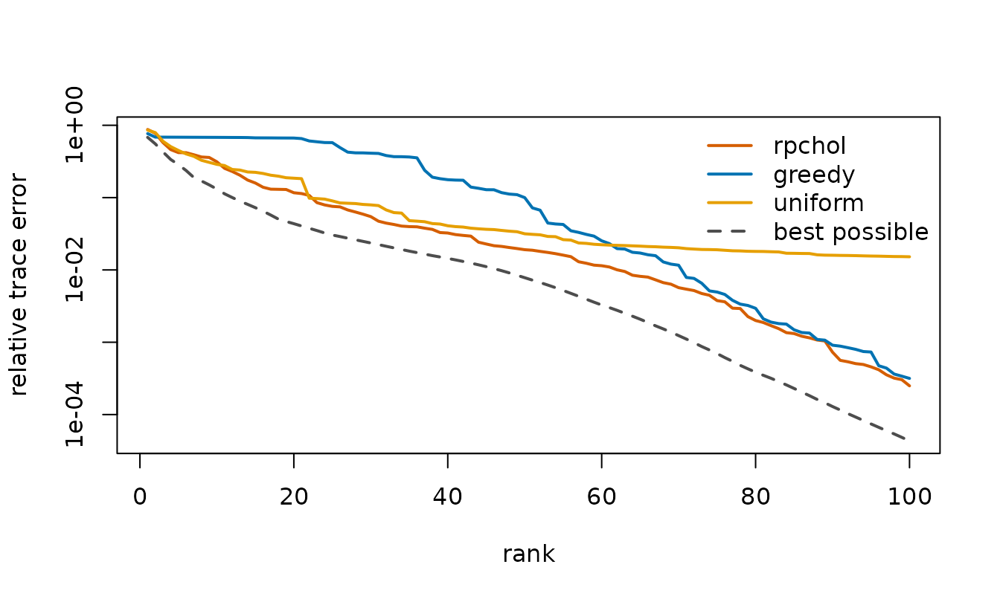
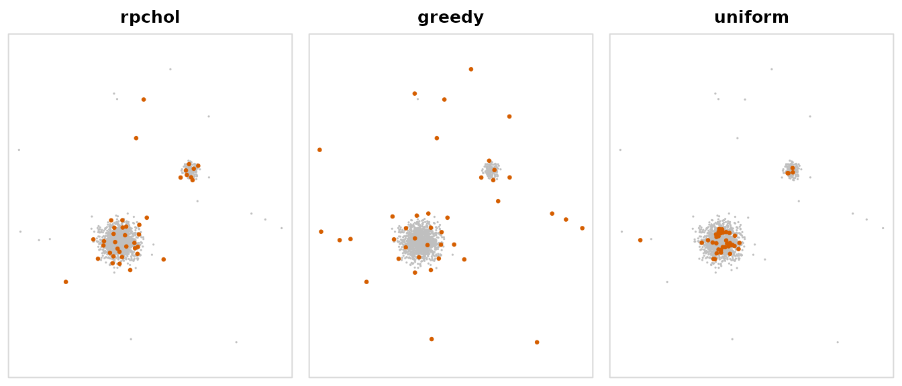
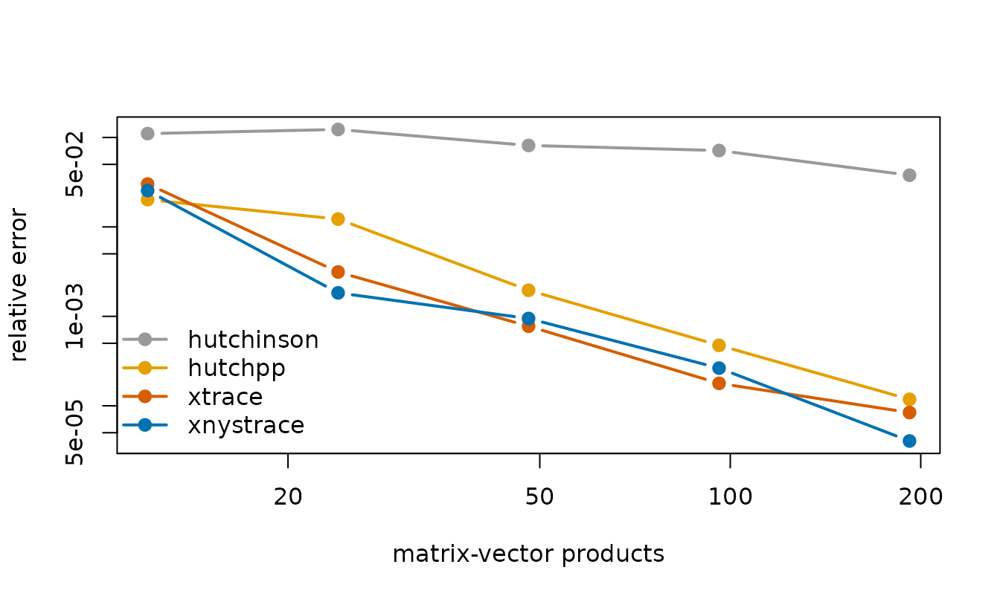
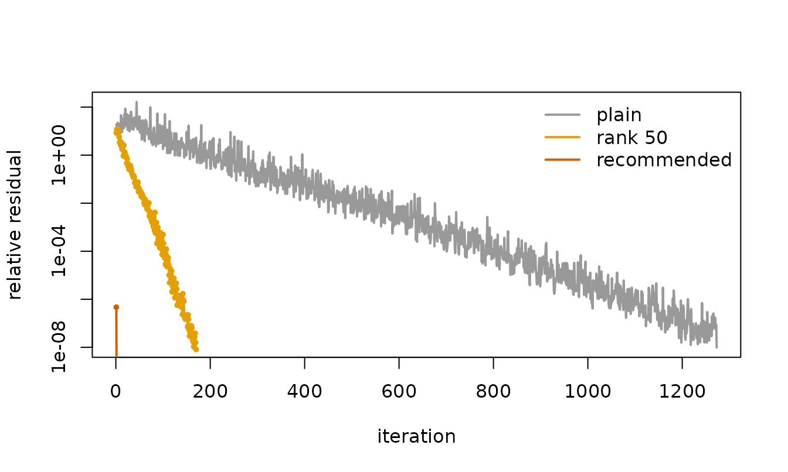

# Randomized matrix computations with matsketch

Large positive-semidefinite matrices turn up throughout statistics:
kernel matrices in Gaussian-process regression, relationship matrices in
quantitative genetics, covariance matrices in spatial models. Holding
one in memory takes $`n^2`$ numbers and factorizing it takes about
$`n^3`$ operations, so exact methods run out of room long before $`n`$
reaches a hundred thousand.

Recent work in randomized numerical linear algebra shows how much can be
done without either step. matsketch brings four of these methods to R.

| Task | Function | What it needs from the matrix |
|:---|:---|:---|
| Low-rank approximation | [`rpchol()`](https://mqfarooqi1.github.io/matsketch/reference/rpchol.md) | about $`(k + 1)n`$ of its entries |
| Trace and diagonal | [`trace_est()`](https://mqfarooqi1.github.io/matsketch/reference/trace_est.md), [`diag_est()`](https://mqfarooqi1.github.io/matsketch/reference/diag_est.md) | $`m`$ products $`A\omega`$ |
| Regularized linear systems | [`nystrom_precond()`](https://mqfarooqi1.github.io/matsketch/reference/nystrom_precond.md), [`pcg()`](https://mqfarooqi1.github.io/matsketch/reference/pcg.md) | products, plus one low-rank approximation |
| Variance components | [`reml_sketch()`](https://mqfarooqi1.github.io/matsketch/reference/reml_sketch.md) | all of the above |

This vignette runs each one on a problem where its advantage is easy to
see. `vignette("genomic-reml", package = "matsketch")` develops the last
one in detail.

``` r

library(matsketch)
```

## Approximating a kernel matrix from a few of its columns

A Nyström approximation rebuilds a positive-semidefinite matrix $`A`$
from a subset $`S`$ of its columns,
$`\hat A = A_{:,S}\, A_{S,S}^{+}\, A_{S,:}`$, and everything depends on
which columns are chosen. Randomly pivoted Cholesky (Chen, Epperly,
Tropp and Webber, 2025) chooses them one at a time, each with
probability proportional to the diagonal of the part of $`A`$ not yet
explained. Greedy pivoting, the classical rule, always takes the largest
residual instead, and uniform sampling ignores the matrix altogether.

The points below form a large cluster, a small cluster and a scatter of
outliers, a layout that defeats both classical rules.

``` r

set.seed(1)
X <- rbind(
  matrix(rnorm(2 * 1300, sd = 0.5), ncol = 2),     # large cluster
  matrix(rnorm(2 * 180, sd = 0.2), ncol = 2) + 4,  # small cluster
  matrix(runif(2 * 20, -6, 10), ncol = 2)          # outliers
)
K <- kernel_matrix(X, "gaussian", bandwidth = 0.5)
K
#> <matsketch_kernel> gaussian kernel on 1500 points, bandwidth 0.5
#>   full matrix would hold 2,250,000 entries; nothing is stored
```

[`kernel_matrix()`](https://mqfarooqi1.github.io/matsketch/reference/kernel_matrix.md)
stores only the points and computes entries when an algorithm asks for
them. Each rule gets a budget of 100 columns, and `trace_path` records
the error after every pivot, so one fit per rule traces out the whole
curve. The best possible error at each rank comes from the eigenvalues,
which only a small example lets us compute:

``` r

rules <- c(rpchol = "accelerated", greedy = "greedy", uniform = "uniform")
fits <- lapply(rules, function(r) rpchol(K, k = 100, method = r))
ev <- eigen(as.matrix(K), symmetric = TRUE, only.values = TRUE)$values
best <- 1 - cumsum(ev[1:100]) / sum(ev)

ranks <- c(20, 40, 100)
tab <- cbind(sapply(fits, function(f) f$trace_path[ranks]), best = best[ranks])
rownames(tab) <- paste("rank", ranks)
signif(tab, 2)
#>           rpchol  greedy uniform    best
#> rank 20  0.12000 0.67000   0.190 4.4e-02
#> rank 40  0.03200 0.18000   0.041 1.4e-02
#> rank 100 0.00025 0.00032   0.015 4.3e-05
```

``` r

cols <- c(rpchol = "#D55E00", greedy = "#0072B2", uniform = "#E69F00")
plot(best, log = "y", type = "l", lwd = 2, lty = 2, col = "grey30",
     ylim = range(best, unlist(lapply(fits, `[[`, "trace_path"))),
     xlab = "rank", ylab = "relative trace error")
for (r in names(fits)) lines(fits[[r]]$trace_path, lwd = 2, col = cols[[r]])
legend("topright", c(names(fits), "best possible"), col = c(cols, "grey30"),
       lty = c(1, 1, 1, 2), lwd = 2, bty = "n")
```



Randomly pivoted Cholesky stays within a small factor of the best
possible error at every rank. Greedy pivoting falls far behind at first,
because it spends its early pivots on the outliers and on isolated
points at the edges of the clusters, each of which explains little
beyond itself; it catches up only after working through them. Uniform
sampling keeps pace early on and then stalls. It almost never draws an
outlier, and every outlier it misses leaves a whole diagonal entry
unexplained: the 20 outliers hold 1.3% of the trace, which is about
where its error levels off. The first 40 pivots of each rule show where
the budget goes:

``` r

op <- par(mfrow = c(1, 3), mar = c(0.5, 0.5, 2, 0.5))
for (r in names(fits)) {
  plot(X, pch = 16, cex = 0.35, col = "grey75", asp = 1, axes = FALSE,
       xlab = "", ylab = "", main = r)
  points(X[fits[[r]]$pivots[1:40], ], pch = 16, cex = 0.7, col = "#D55E00")
  box(col = "grey85")
}
```



``` r

par(op)
```

All three rules read the same small share of the matrix; they differ
only in which entries they read.

``` r

sapply(fits, function(f) f$entries / K$n^2)
#>     rpchol     greedy    uniform 
#> 0.06795556 0.06733333 0.06733333
```

The default `method = "accelerated"` draws pivots from the same
distribution as one-at-a-time random pivoting but proposes them in
blocks and accepts each by rejection sampling (Epperly, Tropp and
Webber, 2025), so most of its work is matrix-matrix arithmetic.

## Estimating a trace from matrix-vector products

Traces of matrices that are expensive to form are everywhere: the
effective degrees of freedom of a smoother, the derivative of a
log-determinant, the score equations of REML. The Girard-Hutchinson
estimator averages $`\omega^\top A \omega`$ over random vectors
$`\omega`$ and needs only products with $`A`$, but its error falls only
like $`1/\sqrt{m}`$ in the number of products $`m`$. Hutch++ (Meyer,
Musco, Musco and Woodruff, 2021) first removes a low-rank approximation
of $`A`$ and estimates only what is left. XTrace (Epperly, Tropp and
Webber, 2024) does the same, but uses every product for both jobs
through a leave-one-out construction, and XNysTrace is its counterpart
for positive-semidefinite matrices.

A test matrix with eigenvalues $`1, 1/4, 1/9, \dots`$:

``` r

set.seed(2)
n <- 500
U <- qr.Q(qr(matrix(rnorm(n * n), n)))
A <- U %*% ((1:n)^-2 * t(U))
trA <- sum(diag(A))
trA
#> [1] 1.642936
trace_est(A, m = 60)
#> <trace_est> xtrace, 60 matrix-vector products
#>   estimate       : 1.64281
#>   standard error : 0.001416
```

XTrace reports a standard error from the spread of its leave-one-out
estimates. The median relative error of each estimator over ten
repetitions, as the budget of products grows:

``` r

budgets <- c(12, 24, 48, 96, 192)
methods <- c(hutchinson = "#999999", hutchpp = "#E69F00",
             xtrace = "#D55E00", xnystrace = "#0072B2")
err <- sapply(names(methods), function(meth) {
  sapply(budgets, function(m) {
    median(replicate(10, abs(trace_est(A, m, meth)$estimate - trA) / trA))
  })
})
matplot(budgets, err, log = "xy", type = "b", pch = 19, lty = 1, lwd = 2,
        col = methods, xlab = "matrix-vector products",
        ylab = "relative error")
legend("bottomleft", names(methods), col = methods, lwd = 2, pch = 19,
       bty = "n")
```



The Girard-Hutchinson line has slope $`-1/2`$; the others fall far
faster, because each extra product also sharpens the low-rank part.
[`diag_est()`](https://mqfarooqi1.github.io/matsketch/reference/diag_est.md)
applies the same construction to the diagonal:

``` r

cor(diag_est(A, m = 100), diag(A))
#> [1] 0.9999593
```

## Solving regularized linear systems

Systems $`(K + \mu I) x = b`$ arise in kernel ridge regression, in
Gaussian-process prediction, and at every step of a REML fit. Conjugate
gradients need only products with $`K`$, but when $`\mu`$ is small they
need many of them. Frangella, Tropp and Udell (2023) precondition with a
low-rank approximation $`K \approx U \hat\Lambda U^\top`$, and show that
a rank of about three times the effective dimension
$`d_{\mathrm{eff}}(\mu) = \mathrm{tr}\{K (K + \mu I)^{-1}\}`$ keeps the
iteration count small regardless of $`n`$.

[`effective_dim()`](https://mqfarooqi1.github.io/matsketch/reference/effective_dim.md)
estimates $`d_{\mathrm{eff}}`$ from any low-rank approximation and
returns the recommended rank:

``` r

set.seed(3)
Z <- matrix(rnorm(3 * 1000), ncol = 3)
K2 <- as.matrix(kernel_matrix(Z, "gaussian", bandwidth = 2))
b <- rnorm(1000)
mu <- 1e-4

ed <- effective_dim(rpchol(K2, k = 200), mu)
ed
#> $d_eff
#> [1] 122.2534
#> 
#> $recommended_rank
#> [1] 369
#> 
#> $sufficient
#> [1] FALSE
```

The estimate from a rank-200 approximation already asks for more than
rank 200, so the preconditioner is built at the recommended rank. For
comparison, a preconditioner of rank 50 and no preconditioner at all:

``` r

precond_of_rank <- function(k) nystrom_precond(rpchol(K2, k), mu)
runs <- list(
  plain = pcg(K2, b, mu = mu, maxit = 5000),
  `rank 50` = pcg(K2, b, mu = mu, precond = precond_of_rank(50)),
  recommended = pcg(K2, b, mu = mu,
                    precond = precond_of_rank(ed$recommended_rank))
)
sapply(runs, `[[`, "iterations")
#>       plain     rank 50 recommended 
#>        1273         170           2
```

``` r

cols <- c("#999999", "#E69F00", "#D55E00")
plot(runs$plain$residuals, log = "y", type = "l", lwd = 2, col = cols[1],
     xlab = "iteration", ylab = "relative residual")
for (i in 2:3) {
  lines(runs[[i]]$residuals, type = "o", pch = 19, cex = 0.4, lwd = 2,
        col = cols[i])
}
legend("topright", names(runs), col = cols, lwd = 2, bty = "n")
```



Even a rank of 50 cuts the count from 1273 iterations to 170. At the
recommended rank the approximation captures nearly all of the matrix
above the level $`\mu`$, and the preconditioned system is so well
conditioned that 2 iterations are enough.

The preconditioner depends on $`\mu`$ only through a diagonal, so one
approximation serves every value of $`\mu`$ an application visits.
[`pcg()`](https://mqfarooqi1.github.io/matsketch/reference/pcg.md) also
accepts a matrix of right-hand sides and advances all of them together,
which turns each step into one matrix-matrix product.

## Variance components on a genomic relationship matrix

[`reml_sketch()`](https://mqfarooqi1.github.io/matsketch/reference/reml_sketch.md)
combines the three tools to fit $`y = X\beta + g + e`$ with
$`g \sim N(0, \sigma^2_g G)`$ by average-information REML, without ever
forming $`V = \sigma^2_g G + \sigma^2_e I`$. With
[`grm_matrix()`](https://mqfarooqi1.github.io/matsketch/reference/grm_matrix.md)
it does not form $`G`$ either, only the genotypes:

``` r

set.seed(4)
dat <- sim_genomic(n = 1000, p = 2000, h2 = 0.5, pops = 4)
G <- grm_matrix(dat$M)
G
#> <matsketch_grm> relationships among 1000 individuals from 2000 markers
#>   full matrix would hold 1,000,000 entries; only genotypes are stored
fit <- reml_sketch(dat$y, G)
fit
#> <reml_sketch> converged in 3 iterations (rpchol rank-100 preconditioner, XTrace with 40 products)
#>          estimate std.error
#> genetic    0.5390    0.0695
#> residual   0.4409    0.0510
#> h2         0.5500    0.0563
#>   linear systems solved : 136 (mean 9.4 CG iterations)
exact <- reml_exact(dat$y, as.matrix(G))
rbind(sketched = c(fit$sigma2, h2 = fit$h2),
      exact = c(exact$sigma2, h2 = exact$h2))
#>            genetic  residual        h2
#> sketched 0.5389685 0.4409309 0.5500243
#> exact    0.5501416 0.4329094 0.5596267
```

At this size the exact fit is still quick. How the two scale, and how
close they stay, is the subject of
`vignette("genomic-reml", package = "matsketch")`.

## References

Chen, Y., Epperly, E. N., Tropp, J. A. and Webber, R. J. (2025).
Randomly pivoted Cholesky: practical approximation of a kernel matrix
with few entry evaluations. *Communications on Pure and Applied
Mathematics* 78, 995–1041.
[doi:10.1002/cpa.22234](https://doi.org/10.1002/cpa.22234)

Epperly, E. N., Tropp, J. A. and Webber, R. J. (2024). XTrace: making
the most of every sample in stochastic trace estimation. *SIAM Journal
on Matrix Analysis and Applications* 45, 1–23.
[doi:10.1137/23m1548323](https://doi.org/10.1137/23m1548323)

Epperly, E. N., Tropp, J. A. and Webber, R. J. (2025). Embrace
rejection: kernel matrix approximation by accelerated randomly pivoted
Cholesky. *SIAM Journal on Matrix Analysis and Applications* 46,
2527–2557. [doi:10.1137/24m1699048](https://doi.org/10.1137/24m1699048)

Frangella, Z., Tropp, J. A. and Udell, M. (2023). Randomized Nyström
preconditioning. *SIAM Journal on Matrix Analysis and Applications* 44,
718–752. [doi:10.1137/21m1466244](https://doi.org/10.1137/21m1466244)

Meyer, R. A., Musco, C., Musco, C. and Woodruff, D. P. (2021). Hutch++:
optimal stochastic trace estimation. *Symposium on Simplicity in
Algorithms*, 142–155.
[doi:10.1137/1.9781611976496.16](https://doi.org/10.1137/1.9781611976496.16)
